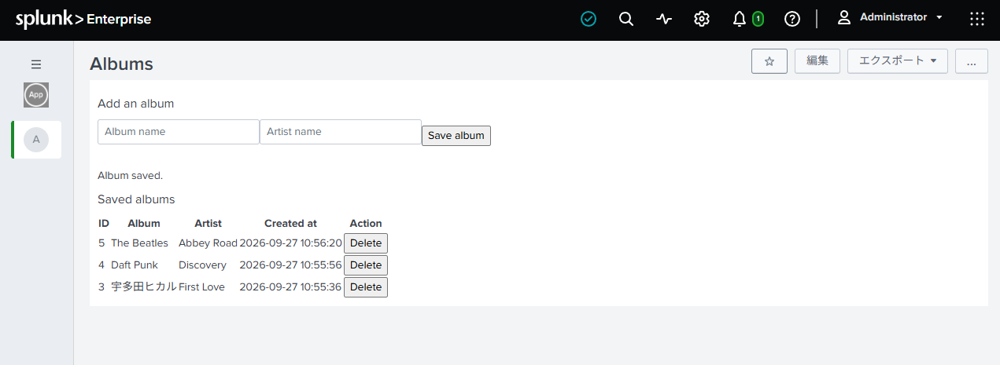
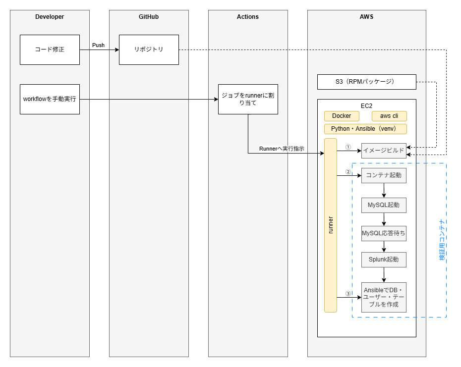
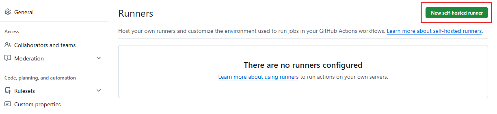
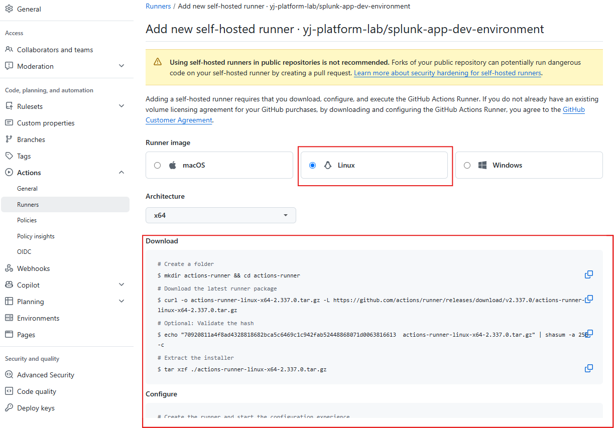
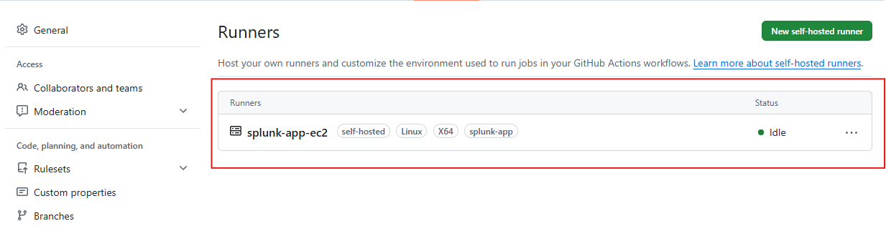
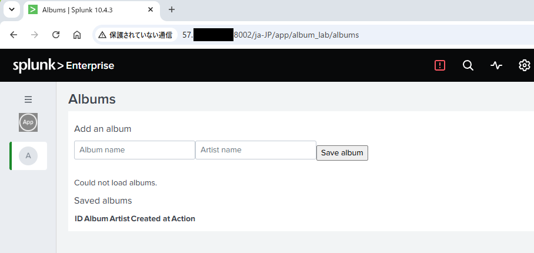
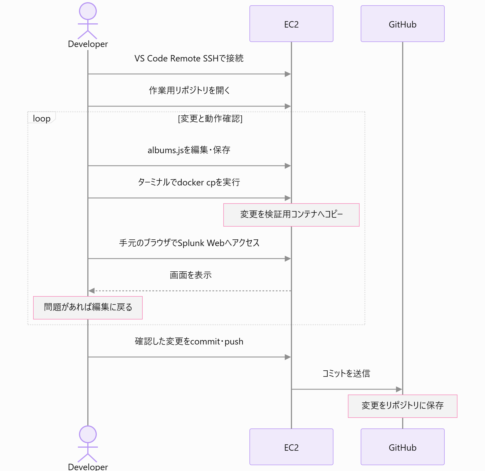
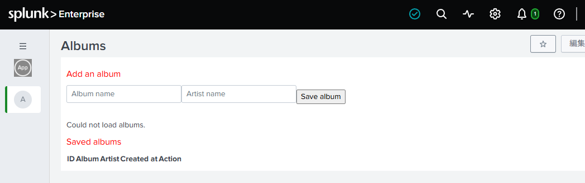

# GitHub ActionsとEC2でSplunkアプリの検証環境を構築する

## 検証の背景

業務で関わるSplunkアプリはコードをGitHubで管理している。しかし、修正後の動作を確認するには検証環境へ手動でファイルを反映する必要があり、変更のたびに転送作業が発生している。この手間を減らせるか確かめるため、サンプルアプリを用意し、GitHub ActionsとEC2を使って検証環境を構築する。

## **サンプルアプリ**

検証には、アルバム情報を管理する簡単なSplunkアプリを使用する。画面でアルバム名とアーティスト名を登録すると、MySQLに保存され一覧に表示される。登録したアルバムの削除もできる。

以下は、ローカルのDocker上で動作を確認したアプリの画面である。


このアプリを使い、ローカルで動作した構成をGitHub Actionsでも再現できるか検証する。


## システム構成

GitHub Actionsの実行環境として、EC2上にself-hosted runnerを配置する。  
runnerはGitHubリポジトリのコードとS3に保存したRPMを取得し、Dockerイメージのビルド、検証用コンテナの起動、AnsibleによるDB設定を行う。  
検証用コンテナ内ではMySQLとSplunkを起動する。図中の①〜③は、runnerが実行する処理を示している。



## 事前準備

SplunkとMySQLのRPMを保存するS3バケットを作成し、パッケージをアップロードしておく。また、UbuntuのEC2インスタンスを作成し、以下を導入する。

- Docker：イメージのビルドとコンテナの起動に使用する。
- AWS CLI：`aws s3 sync`でS3からRPMを取得する。
- Python・python3-venv：仮想環境を作成し、Ansibleと必要なコレクションを導入する。
- GitHub Actionsのself-hosted runner：インストール後、対象リポジトリに登録する。

EC2には、対象S3バケットのRPMを読み取れるIAMロールを割り当てる。

### **Dockerのインストール**

Docker Engineのインストールは、以下の公式ドキュメントに従って行う。  
[https://docs.docker.com/engine/install/ubuntu/](https://docs.docker.com/engine/install/ubuntu/)

インストール後、公式ドキュメントの記載の通り以下のコマンドを実行し、Hello from Docker!が表示されることを確認する。

```bash
sudo docker run hello-world
```

### runnerのインストールと登録

GitHubリポジトリの Settings → Actions → Runners → New self-hosted runner を開く。  


Runner imageでLinuxを選択し、EC2のアーキテクチャに対応する手順に従って、runnerのダウンロードと設定を行う。今回はubuntuユーザーで実行する。  


./config.shのコマンド実行時の設定値は以下のように設定。

| 質問 | 入力 |
| --- | --- |
| Runner group | Enterで既定値 |
| Runner name | `splunk-app-ec2` |
| Additional labels | `splunk-app` |
| Work folder | Enterで `_work` |


コマンドが成功すると以下のように表示される。

```
ubuntu@ip-192-168-2-228:~/actions-runner$ ./config.sh --url https://github.com/yj-platform-lab/splunk-app-dev-environment --token YOUR_TOKEN 

--------------------------------------------------------------------------------
|        ____ _ _   _   _       _          _        _   _                      |
|       / ___(_) |_| | | |_   _| |__      / \   ___| |_(_) ___  _ __  ___      |
|      | |  _| | __| |_| | | | | '_ \    / _ \ / __| __| |/ _ \| '_ \/ __|     |
|      | |_| | | |_|  _  | |_| | |_) |  / ___ \ (__| |_| | (_) | | | \__ \     |
|       \____|_|\__|_| |_|\__,_|_.__/  /_/   \_\___|\__|_|\___/|_| |_|___/     |
|                                                                              |
|                       Self-hosted runner registration                        |
|                                                                              |
--------------------------------------------------------------------------------

# Authentication

√ Connected to GitHub

# Runner Registration

Enter the name of the runner group to add this runner to: [press Enter for Default]

Enter the name of runner: [press Enter for ip-192-168-2-228] splunk-app-ec2

This runner will have the following labels: 'self-hosted', 'Linux', 'X64'
Enter any additional labels (ex. label-1,label-2): [press Enter to skip] splunk-app

√ Runner successfully added

# Runner settings

Enter name of work folder: [press Enter for _work]

√ Settings Saved.

```

<br>

**runnerの実行ユーザーにDockerの操作権限を付与**

runnerからDockerを操作できるように、ubuntuユーザーをdockerグループへ追加する。この設定がないと、後続のworkflowでDockerを操作する際に、/var/run/docker.sockへのアクセスがpermission deniedとなる。

```bash
sudo usermod -aG docker ubuntu
```

<br>

**runnerの起動と確認**

公式ドキュメントに記載の通り、./run.shを実行。  
最終的に以下のように表示されればOK。注意点として、./run.shが起動中だけrunnerは動いているので、毎回の起動が面倒だったらサービス化すること。



## 検証用イメージのビルドとコンテナ起動

構成図に沿って、GitHub ActionsからEC2上のself-hosted runnerを使い、イメージのビルドとコンテナの起動を行う。起動だけをやり直せるようにビルド用と起動用のworkflowを分ける。

### イメージのビルド

まず、`.github/workflows/build-image.yml` を手動実行し、S3からRPMを取得して `splunk-app:local` をビルドする。  
実行時の注意点は以下の通り。

- RPMの取得に使用するAWS CLIを、あらかじめEC2に導入しておく。
- 対象S3バケットを読み取れるIAMロールをEC2に割り当てる。
- RPMの取得には `aws s3 cp` ではなく `aws s3 sync` を使用し、取得済みファイルが残っている場合の再転送を抑える。
- ビルドに必要なメモリを確保できるインスタンスタイプを選ぶ。筆者環境では `t3.medium` を使用した。

### コンテナの起動

ビルド成功後、`.github/workflows/deploy.yml` を手動実行する。実行時の注意点は以下の通り。

- 通常の設定値は `app.env`、Splunkの管理者パスワードはGitHub ActionsのSecretsに登録した `SPLUNK_PASSWORD` から渡す。
- コンテナ起動時に、Dockerfileの `ENTRYPOINT` で指定した `entrypoint.sh` が実行される。
- `entrypoint.sh` はMySQLをバックグラウンドで起動し、応答を確認してからSplunkを起動する。

### **DB設定の確認**

コンテナ起動後、Ansibleで設定した以下の項目を確認する。

- `album_lab` データベースと `albums` テーブルが存在すること。
- `album_app@localhost` に、`album_lab.*` の `SELECT, INSERT, DELETE` 権限が付与されていること。
- 設定したパスワードでアプリ用ユーザーとしてログインし、テーブルを参照できること
- MySQLの応答を確認後、runner上のAnsibleから `ansible/provision-db.yml` を実行し、DB・ユーザー・権限・テーブルを設定する。

### Splunk Webへのアクセス

コンテナ起動後、手元のブラウザで以下を開く。

```
http://<EC2の現在のパブリックIP>:<EC2側の公開ポート>
```

- 筆者環境では、`deploy.yml` で公開ポートを `8002` に設定した。
- セキュリティグループで、TCP 8002への接続を自分の接続元グローバルIP（`/32`）から許可する。
- このルールはTerraformで管理せず、手動で追加した。接続元には `0.0.0.0/0` を指定せず、自分のIPに限定した。



## 開発中のコード変更

また、開発中のコード変更の流れは以下となる（修正ファイルalbums.jsは仮）



開発者はVS Code Remote SSHでEC2に接続し、作業用リポジトリのコードを編集する。変更したファイルを`docker cp`で検証用コンテナへ反映し、手元のブラウザで動作を確認する。問題があれば修正と確認を繰り返し、確認できた変更をcommit・pushしてGitHubへ反映する。

たとえば文字色を変える場合、splunk-app/album_lab/appserver/static/albums.jsを編集して以下のように表示されることを確認。



この時、画面が更新されなければ、以下のURLでbumpを実行してから再度確認する

```
http://<EC2の現在のパブリックIP>:<EC2側の公開ポート>/en-US/_bump
```

## 今後の課題

- イメージサイズが大きく、ビルドや転送に時間がかかる。
- 複数人で検証する場合、ポート・コンテナ名・volume名を分ける必要がある。
- EC2への各種ツールの導入と、OS更新やディスク容量の管理が必要になる。

構築を進める中で、複数人での利用や実行基盤の保守を考えると、ECS Fargateのほうが今回の用途に適しているのではないかと感じた。次はFargateでの構成を検証し、イメージの軽量化も進める。